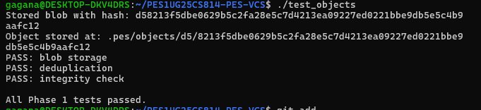
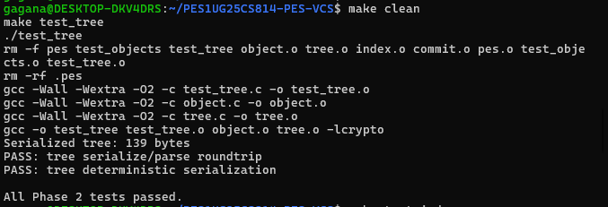
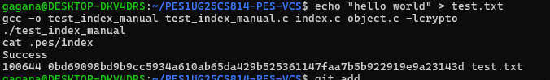
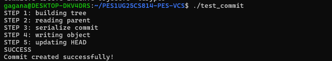
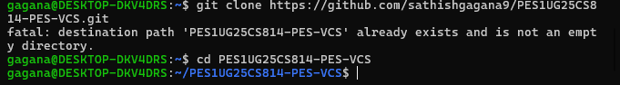

# PES-VCS — Version Control System from Scratch

## 💻 Author

 Gagana B S
PES1UG25CS814

---

##  Objective

To build a simplified version control system similar to Git that:

* Stores file contents using SHA-256 hashing
* Tracks changes using an index (staging area)
* Builds directory trees
* Creates commits with history tracking

---

## Platform

Ubuntu 22.04 (WSL)

---

##  Project Structure

```
.pes/
 ├── objects/        # stores blobs, trees, commits
 ├── refs/heads/     # branch pointers
 ├── index           # staging area
 └── HEAD            # current branch
```

---

##  Phase 1: Object Storage

### Features Implemented

* SHA-256 hashing
* Object storage with directory sharding
* Deduplication
* Integrity verification


---

##  Phase 2: Tree Objects

### Features Implemented

* Tree serialization
* Directory structure handling
* Deterministic ordering



---

##  Phase 3: Index (Staging Area)

### Features Implemented

* Add files to index
* Save/load index file
* Track metadata (mode, hash, path)



---

##  Phase 4: Commit System

### Features Implemented

* Tree creation from index
* Commit object creation
* Parent linking (history)
* HEAD and branch updates



---

##  Integration Test



---

## Analysis Questions

### Q5.1 — Branch Checkout

A branch is a file containing a commit hash.
To implement checkout:

* Update `.pes/HEAD` to point to new branch
* Update working directory to match tree of target commit
  Complexity arises due to handling uncommitted changes.

---

### Q5.2 — Dirty Working Directory

Compare:

* Working directory vs index
* Index vs last commit

If mismatch exists → prevent checkout.

---

### Q5.3 — Detached HEAD

HEAD points directly to a commit instead of a branch.
New commits are not referenced by any branch.
Recovery:

* Create a new branch pointing to that commit.

---

### Q6.1 — Garbage Collection

Use graph traversal:

* Start from all branch heads
* Mark reachable objects
* Delete unreferenced objects

Data structure: Hash set for visited nodes.

---

### Q6.2 — GC Race Condition

If GC runs during commit:

* It may delete objects not yet referenced

Solution:

* Locking or mark-and-sweep with safety delay (like Git).

---

##  Conclusion

Successfully implemented a mini version of Git with:

* Object storage
* Tree structure
* Index (staging)
* Commit history

---

##  GitHub Repository

https://github.com/sathishgagana9/PES1UG25CS814-PES-VCS

---
